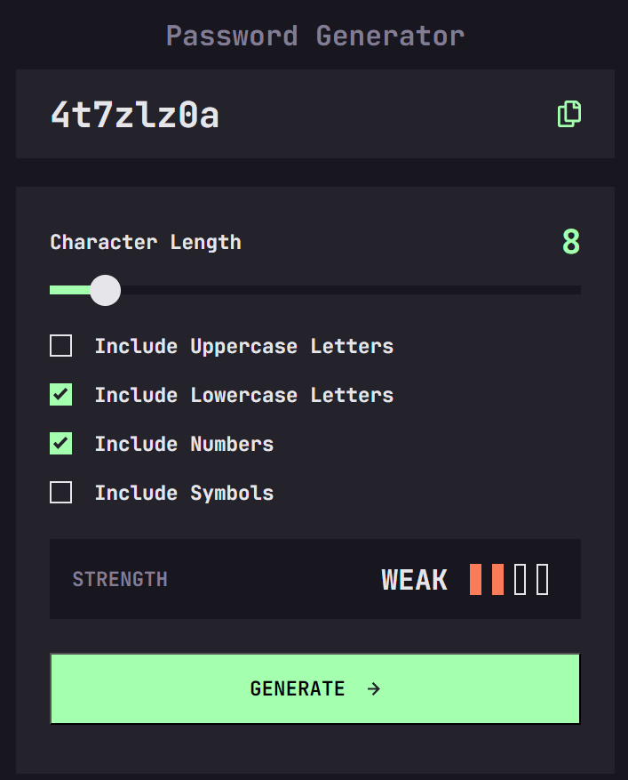
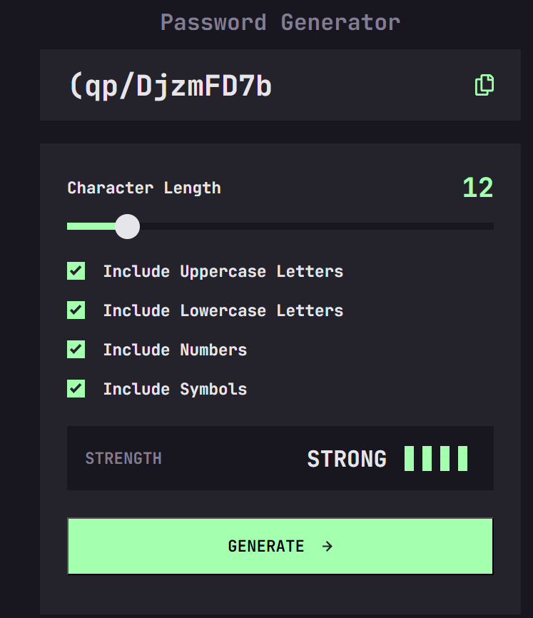
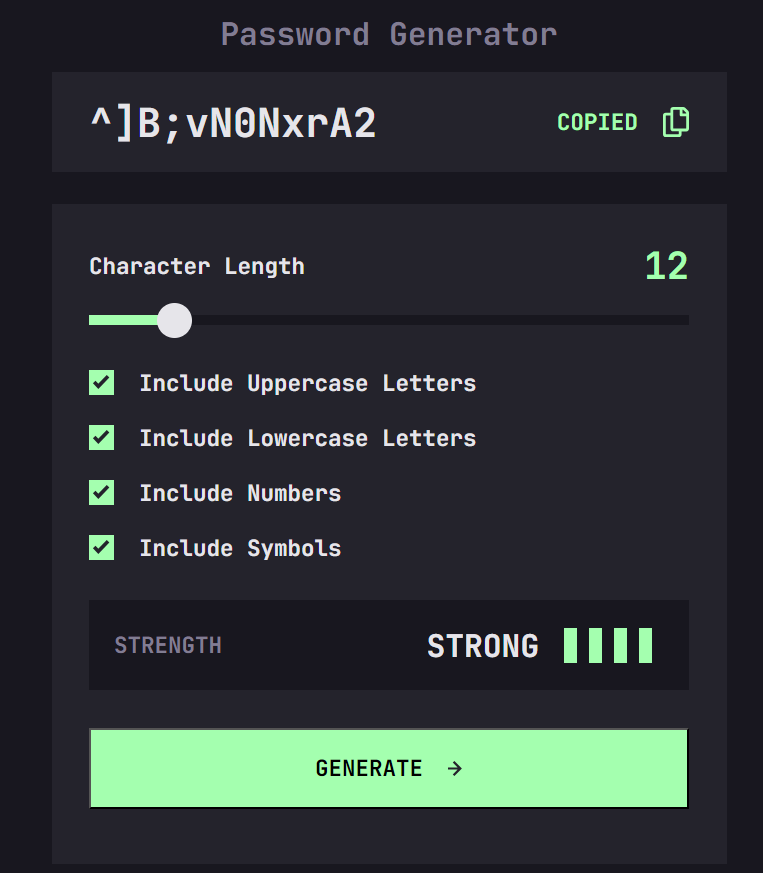

# Frontend Mentor - Password generator app solution

This is a solution to the [Password generator app challenge on Frontend Mentor](https://www.frontendmentor.io/challenges/password-generator-app-Mr8CLycqjh). Frontend Mentor challenges help you improve your coding skills by building realistic projects. 

## Table of contents

- [Frontend Mentor - Password generator app solution](#frontend-mentor---password-generator-app-solution)
  - [Table of contents](#table-of-contents)
  - [Overview](#overview)
    - [The challenge](#the-challenge)
    - [Screenshot](#screenshot)
    - [Links](#links)
    - [Built with](#built-with)
  - [Author](#author)
  - [Contributing](#contributing)
  - [Show Your Support](#show-your-support)

**Note: Delete this note and update the table of contents based on what sections you keep.**

## Overview

### The challenge

Users should be able to:

- Generate a password based on the selected inclusion options
- Copy the generated password to the computer's clipboard
- See a strength rating for their generated password
- View the optimal layout for the interface depending on their device's screen size
- See hover and focus states for all interactive elements on the page

### Screenshot

### Links

- Solution URL: [Solution](https://github.com/Slimani-CE/front-end-mentor-ch13)
- Live Site URL: [Live Site](https://slimani-ce.github.io/front-end-mentor-ch13)

### Built with

- Semantic HTML5 markup
- CSS custom properties
- Flexbox
- CSS Grid
- Mobile-first workflow

## Author

- Website - [HERE](https://www.your-site.com)
- Frontend Mentor - [@Slimani-CE](https://www.frontendmentor.io/profile/Slimani-CE)
- Twitter - [@mstapha4real](https://twitter.com/mstapha4real)

## Contributing
Contributions are always welcome! If you find any issues with the code or have suggestions for improvements, please feel free to submit a pull request.

Just remember, we are not responsible for any broken keyboards or late-night coding sessions that may result from your contributions! 😄

## Show Your Support
If you found this notebook helpful, please give it a ⭐️ to show your support!